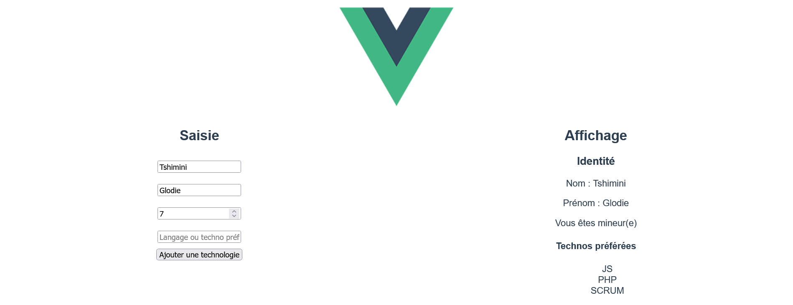

# Exercice 3

--- 

## Modalité

- Au départ, la partie affichage n'est pas visible à l'écran, c'est uniquement lorsque l'utilisateur saisit au moins une donnée que cette partie devient visible.
- Idem pour les technos, c'est-à-dire, tant qu'aucune techno a été ajoutée, la partie dédiée à l'affichage de technos ne doit pas être visible.

---

## Enoncé

1. Créez un nouveau projet Vue.
2. En utilisant les propriétés, directives et les événements Vue :
Ajoutez un formulaire pour saisir les informations suivantes : 
- Nom
- Prénom
- Age
- Langages et technos préférées (Un langage peut être ajouté à partir d'un bouton ou en appuyant sur la touche "entrée" du clavier, cf. illustration ci-dessous)
Affichez les informations suivantes :
- Nom
- Prénom
- Si l'âge est supérieur ou égal à 18 ans, affichez le message "vous êtes majeur(e)", sinon affichez "Vous êtes mineur(e)"
- Sous forme de liste à puces, les langages et technos préférées.

---

## Bonus

1. Désactivez le bouton "ajoutez une techno" lorsque le champ de saisie de la techno est vide.
2. Ajoutez des boutons de suppression aux technos ajoutées.

---

## Illustration

