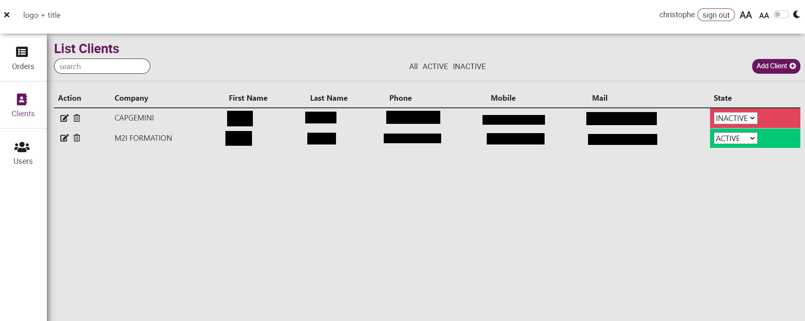
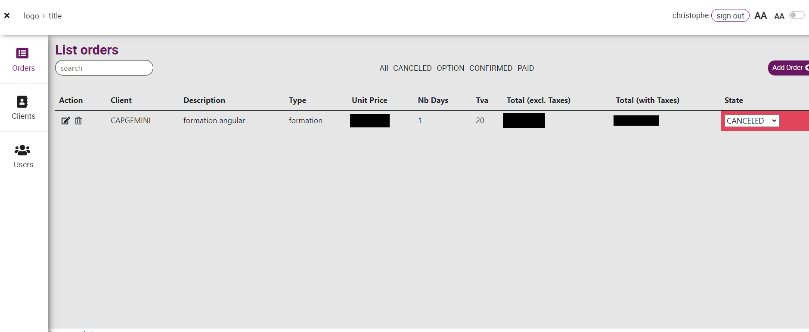

# TP CRM

---

## Modalités

Les templates ci-dessous servent d'exemple pour uniquement illustrer les fonctionnalités.

---

## Énoncé

1. Réalisez le CRM en intégrant au moins un :
- Un *router*
- Un *store*

---

## Exemples

---

