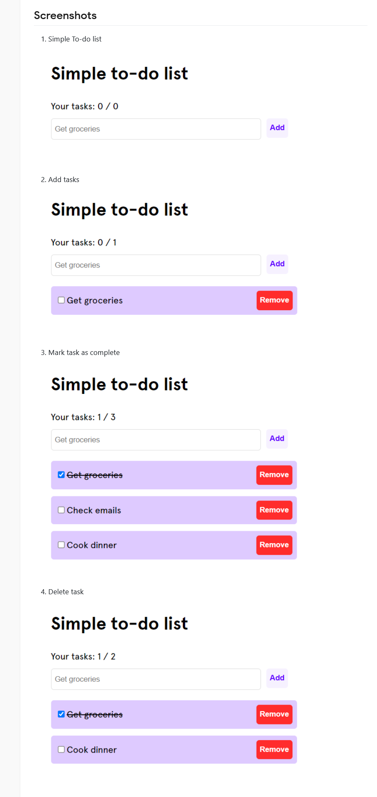

# TP CRM

---

## Enoncé

1. Réalisez la todolist
2. Implémentez un store pour pouvoir stocker les données et avoir éventuellement besoin d'utiliser une autre todolist avec les mêmes données dans une autre page de votre application.

---

## Exemples

[Crédit vuejsexamples](https://vuejsexamples.com/a-simple-web-application-that-allows-users-to-create-and-manage-a-list-of-tasks/)